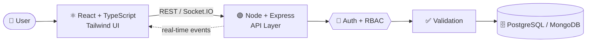

<!-- ============ HEADER BANNER ============ -->
<div align="center">


<a href="https://github.com/digambarbh">
  
</a>

<br/><br/>

<a href="https://github.com/digambarbh"></a>
<a href="https://www.linkedin.com/in/YOUR_LINKEDIN/"></a>
<a href="https://YOUR_PORTFOLIO_URL"></a>
<a href="mailto:YOUR_EMAIL@example.com"></a>

<br/><br/>


</div>

<br/>

<!-- ============ ABOUT ============ -->
<h2 align="center">✨ About Me</h2>

<div align="center">

I'm a **Full-Stack Developer** focused on building complete web applications —<br/>
from responsive interfaces and REST APIs to authentication, databases and real-time features.<br/>
I enjoy turning ideas into **clean, maintainable, production-oriented apps**.

</div>

<br/>

<table align="center">
<tr>
<td width="50%" valign="top">

```bash
$ whoami
digambar

$ cat about.txt
🔭 Building full-stack web apps
🌱 Learning system design & scalable architecture
⚡ Love real-time features & clean APIs
🎯 Aiming for production-grade code
🤝 Open to collaborate on cool projects

$ echo $MOTTO
Build → Debug → Refactor → Improve → Ship
```

</td>
<td width="50%" valign="top">

```ts
const digambar = {
  role: "Full-Stack Developer",
  frontend: ["React", "TypeScript", "Tailwind"],
  backend: ["Node.js", "Express", "REST"],
  databases: ["PostgreSQL", "MongoDB"],
  auth: ["Better Auth", "Passport", "RBAC"],
  realtime: ["Socket.IO"],
  learning: ["System Design", "TanStack Query"],
  coffee: Infinity,
};
```

</td>
</tr>
</table>

<br/>

<!-- ============ TECH STACK ============ -->
<h2 align="center">⚡ Tech Stack</h2>

<div align="center">

### 🎨 Frontend


### ⚙️ Backend & Databases


### 🧰 Tools & Workflow


<br/><br/>


</div>

<br/>

<!-- ============ PROJECTS ============ -->
<h2 align="center">🚀 Featured Projects</h2>

<table align="center">
<tr>
<td width="50%" valign="top">

### 🏢 Staff Desk
*Employee Management System*

A full-stack platform built around real-world organizational workflows, role-based access and centralized employee operations.

**Stack**
<br/>


**Highlights**
- 👥 Employee & department management
- 📊 Attendance tracking
- 📢 Admin announcements
- 🔐 Session auth + RBAC (Better Auth)
- ⚡ Real-time communication
- 🗄️ Drizzle ORM + PostgreSQL

<a href="https://github.com/digambarbh/staff-desk">
  
</a>

</td>
<td width="50%" valign="top">

### 🏨 StayEase
*Accommodation & Travel Booking Platform*

A full-stack booking platform inspired by modern travel apps — discover stays, manage listings and handle bookings.

**Stack**
<br/>


**Highlights**
- 🏠 Property listings
- 📅 Booking management
- ⭐ Reviews & ratings
- ☁️ Cloudinary image uploads
- 🗺️ Interactive maps (Leaflet)
- 🔒 Authentication & authorization

<a href="https://github.com/digambarbh/stayease">
  
</a>

</td>
</tr>
</table>

<br/>

<!-- ============ ARCHITECTURE ============ -->
<h2 align="center">🧠 How I Architect Apps</h2>



<br/>

<!-- ============ ENGINEERING FOCUS ============ -->
<h2 align="center">🏗️ Engineering Focus</h2>

<div align="center">

| 🧩 Architecture | 🔌 Backend | 🎨 Frontend |
|:---|:---|:---|
| ✅ Component-based design | ✅ RESTful API design | ✅ Reusable UI components |
| ✅ Clean project structure | ✅ Authentication & RBAC | ✅ Responsive layouts |
| ✅ Modular code | ✅ Input validation | ✅ Smart data fetching |
| ✅ Git-based workflow | ✅ Error handling & API testing | ✅ Real-time UI updates |

</div>

<br/>

<!-- ============ CURRENTLY IMPROVING ============ -->
<h2 align="center">📚 Currently Improving</h2>

<div align="center">


</div>

<br/>

<!-- ============ GITHUB STATS ============ -->
<h2 align="center">📊 GitHub Stats</h2>

<div align="center">


<br/>


<br/><br/>


<br/><br/>


</div>

<br/>

<!-- ============ SNAKE ============ -->
<div align="center">

<picture>
  <source media="(prefers-color-scheme: dark)" srcset="https://raw.githubusercontent.com/digambarbh/digambarbh/output/github-snake-dark.svg" />
  <source media="(prefers-color-scheme: light)" srcset="https://raw.githubusercontent.com/digambarbh/digambarbh/output/github-snake.svg" />
  
</picture>

</div>

<br/>

<!-- ============ QUOTE ============ -->
<div align="center">


</div>

<br/>

<!-- ============ CONNECT ============ -->
<h2 align="center">🤝 Let's Connect</h2>

<div align="center">

<a href="https://github.com/digambarbh"></a>
<a href="https://www.linkedin.com/in/YOUR_LINKEDIN/"></a>
<a href="mailto:YOUR_EMAIL@example.com"></a>
<a href="https://YOUR_PORTFOLIO_URL"></a>

<br/><br/>

**Thanks for visiting my profile — feel free to explore my repositories and connect with me.** ⭐


</div>
